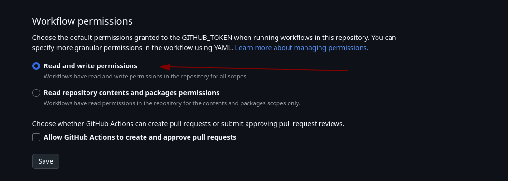

# create-ros-app

A template for creating robust ROS2 (Robot Operating System) applications, designed for large-scale, end-to-end robotics projects. This template is optimized for maintaining consistency and quality across multiple ROS2 packages and project components.

## What? Why?

When you build a robot, you have to juggle a **ton** of opinionated decisions before you so much as tell an actuator to move.

This template helps streamline the development of ROS2 applications by setting up a standardized project structure, tooling, and configuration for ROS2 packages, ensuring that every project starts with consistent settings and follows best practices. It also includes a centralized linting and testing setup to ensure code quality across packages.

## This feels like a lot. Where do I even start?

Don't worry. All of these features will feel natural if you just stick to the scripts and
commands in the [about_template.md](%7B%7Bcookiecutter.project_name%7D%7D/docs/about_template.md) Scripts section.

Start by editing code in the example nodes generated under `pkgs`, then play around with
the example `launcher.py` files under `launch-profiles/` to see how to launch your nodes.

Eventually, you'll be comfortable with all the features of this template, and you'll be able to
edit and add to them as you see fit.

## Features

The full documentation for the project features can be found in [about_template.md](%7B%7Bcookiecutter.project_name%7D%7D/docs/about_template.md)

- **Containerized ROS2 Environment**: The project only needs `docker` to run. You only need to know a few simple commands to launch your project. 
  - **Launch** specific ROS2 components or full stacks with `docker/launch`.
  - **Run** components in isolation using `docker/run`.
  - **Execute** commands within running containers using `docker/exec`.
  - **Test** all ROS2 packages with `docker/test`.
  - **Display and Sound Passthrough**: Projects come pre-configured with `x11` and `pulseaudio` passthrough, so you can run GUI applications and hear sound from within the container.
- **Logging Made Easy**: Projects come pre-configured with `grafana`, `loki` and `promtail`, so you can search and browse logs easily under `http://localhost` after launching.
- **Standardized ROS2 Project Structure**: 
  - Pre-organized packages under `pkgs.`
  - The `launch-profiles/` directory lets you create separate ROS2 "apps" where launchfiles, configuration, model files can live in one place separate from the package code.
- **Dependencies are Organized and Automatically Installed**: ROS2 dependencies go in a `package.xml`, python dependencies go in the `pyproject.toml`, and the `Dockerfile` has a spot for apt dependencies.
- **Centralized Linting and Testing**: A preconfigured linter tool for Python, C++, and bash runnable via `poetry run lint`
- **GitHub Actions CI/CD**: Pre-configured workflows for continuous integration, including linting, testing, and optional Codecov integration to monitor code coverage.
- **Cruft Integration for Template Sync**: Ensures projects remain up-to-date with the latest template improvements, allowing the team to adopt new best practices with minimal effort.


## Quick Start Guide

Here's how you create your first ROS2 app:

1. Install Cruft (if not already installed):

   This tool allows you to create projects from 'cookiecutter' repositories, such as this one. 
   ```shell
   pip install cruft
   ```
2. Initialize the template. This will create a new directory where the project files will
   be dumped.
   
   Fill in the form with the appropriate values for your project. The values in the 
   parameters are the default values that will be used if you don't fill in your own.
   ```shell
   cruft create https://github.com/UrbanMachine/create-ros-app.git
   ```
3. Check that everything is synced with the template repository
   ```shell
   cruft check
   ```


### Updating a Template on an Existing Project 
To pull in the latest template changes:
1.Run the following:
   ```shell
   cruft update --allow-untracked-files
   ```
2. Follow the prompts and resolve any merge conflicts that arise.

## Post Set-Up Guide
### Lock the Root pyproject.toml File

This project requires poetry for linting. You can get it [here](https://python-poetry.org/docs/). 

After adding the template to your project, you should lock the `pyproject.toml` file to ensure that all developers use the same dependencies. This file is generated by Poetry and should be committed to the repository. To lock the file, run:
```shell
poetry lock
```

Then commit the `pyproject.lock` file to the repository.

### Commit the generated `.env` File

A `.env` file is generated by the template to store important env variable. These are 
automatically read by `docker-compose` when you run the project.

However, it's added to the `.gitignore` file because `.env` files can contain sensitive
information.

Commit the first generated `.env` file to the repository.

```shell
git add .env
git commit -m "Add .env file"
```

### Fixing the `lint` Github Action
This template automatically runs CI via github actions on every pull request. 

The CI uses cruft to check if there's been upstream changes on the template repository.
Depending on how you clone the repository, you might get the following error:

```shell
╭─ Error ──────────────────────────────────────────────────────────────────────╮
│ Unable to initialize the cookiecutter using                                  │
│ git@github.com:UrbanMachine/create-ros-app.git! Failed to clone the repo.    │
│ stderr: 'Cloning into '/tmp/tmpavykj68r'...                                  │
│ git@github.com: Permission denied (publickey).                               │
│ fatal: Could not read from remote repository.                                │
│                                                                              │
│ Please make sure you have the correct access rights                          │
│ and the repository exists.                                                   │
│ '                                                                            │
╰──────────────────────────────────────────────────────────────────────────────╯
```

If you do, it's because github actions is trying to use SSH to clone the template repo, 
and failing. To fix this, edit your `.cruft.json` `template` key so it points to the
repository using `https://...your-url...git`

### Fixing Test+Build Workflow

This template will set up a CI pipeline that automatically builds images of the latest
commit on each branch, and tags them `YOUR_GITHUB_ORG/PROJECT_NAME:BRANCH_NAME`.

However, it will initially fail until you give your workflow permissions to push to the
github Docker registry.

You'll see something like:

```shell
#36 exporting to image
#36 pushing layers 0.2s done
#36 ERROR: failed to push ghcr.io/YOUR_GITHUB_ORG/PROJECT_NAME:BRANCH_NAME: unexpected status from POST request to https://ghcr.io/v2/.../.../blobs/uploads/: 403 Forbidden
```

To fix this, go to the following page and configure Read Write Permissions as shown below.
https://github.com/YOUR_GITHUB_ORG/PROJECT_NAME/settings/actions



### Optional: Adding Codecov Support
Codecov let's your project report on test coverage on every pull request. This process requires being an Admin on the github org this project lives in.

1. Sign in to [Codecov](https://about.codecov.io/sign-up/) with your Github account.
2. Under your repository in Codecov, select "Configure".
3. Get a codecov API token. Settings can be found under:
   https://app.codecov.io/gh/GITHUB_ORG/PROJECT_NAME/
4. Add a secret named `CODECOV_TOKEN` to your Github repositories secrets. Settings can be found under: 
   https://github.com/GITHUB_ORG/PROJECT_NAME/settings/secrets/actions
6. You should now be able to see code coverage under codecov!

